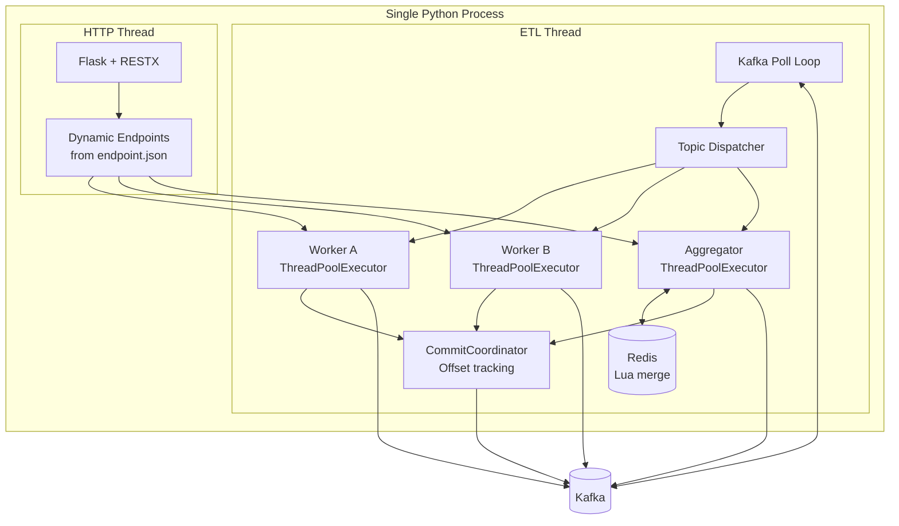

# QF Framework — Kafka Workers & Dynamic HTTP API

A Python framework for building high-throughput Kafka ETL workers and dynamic HTTP APIs from a single application, using decorator-based worker declaration and per-worker thread pools.

---

## Architecture



---

## Core Concepts

| Concept | Description |
|---|---|
| `@kafka_handler` | Registers a function as a Kafka worker (single or bulk mode) |
| `@kafka_aggregator` | Registers a function that merges messages from multiple topics using Redis |
| `@retry_to_dlq` | Policy: retry N times, then route to DLQ topic |
| `@rate_limit` | Policy: token-bucket throttle on job dispatch rate |
| `@circuit_breaker` | Policy: trip open on consecutive failures, auto-reset |
| `CommitCoordinator` | Tracks out-of-order job completions; advances offset window correctly |
| Backpressure | Per-TP pause/resume when worker pool is saturated |
| Bulk mode | Buffer N messages per partition, flush on size OR timeout |
| `FrameworkApp` | High-level entrypoint: starts ETL thread + Flask server |

---

## Quick Start

```bash
# Start infrastructure
cd poc_app && docker compose up -d

# Install dependencies
python -m venv venv && source venv/bin/activate
pip install -r poc_app/requirements.txt
pip install -r requirements.txt

# Configure
cp poc_app/.env.example poc_app/.env

# Run the POC app
cd poc_app && python app.py
```

---

## Defining Workers

### Single-message handler

```python
from framework.decorators import kafka_handler, retry_to_dlq

@kafka_handler(
    name="ner",
    topics_in=["text.in"],
    topics_out=["text.ner"],
    max_workers=8,
)
@retry_to_dlq(max_attempts=3, dlq_topic="text.dlq")
def ner_worker(message: dict, consumer_name: str, metadatas: dict) -> dict:
    message["entities"] = extract_entities(message["text"])
    return message
```

### Bulk handler (batches)

```python
@kafka_handler(
    name="translate",
    topics_in=["translate.in"],
    topics_out=["translate.out"],
    max_workers=4,
    bulk_mode=True,
    batch_size=50,
    batch_timeout_ms=250,
)
def translate_bulk(messages: list[dict], consumer_name: str, metadatas: dict) -> list[dict]:
    return [translate(m) for m in messages]
```

### Aggregator (merge multiple topics)

```python
from framework.decorators import kafka_aggregator

@kafka_aggregator(
    name="merge",
    topics_in=["events.part_a", "events.part_b"],
    topics_out=["events.merged"],
    aggregate_by="id",
    aggregator_timeout_sec=600,
    max_workers=4,
)
def merge_worker(merged: dict, consumer_name: str, metadatas: dict) -> dict:
    merged["complete"] = True
    return merged
```

---

## Starting the ETL Runtime

```python
from framework.etl.framework_etl import start
from config import Config

start(
    worker_modules=["workers.my_workers"],
    bootstrap_servers=Config.KAFKA_BOOTSTRAP_SERVERS,
    consumer_name=Config.WORKER_NAME,
)
```

Or with the high-level entrypoint:

```python
from framework.app import FrameworkApp, FrameworkSettings

settings = FrameworkSettings(
    enable_etl=True,
    enable_api=True,
    worker_modules=["workers.my_workers"],
    kafka_bootstrap_servers="localhost:9094",
    consumer_name="my-app",
    endpoint_json_path="maps/endpoint.json",
    api_port=5000,
)
fw = FrameworkApp(settings, app_root=Path(__file__).resolve().parent)
handles = fw.run()
handles.app.run(host="0.0.0.0", port=5000)
```

---

## Configuration

| Key | Default | Description |
|---|---|---|
| `WORKER_NAME` | — | Kafka consumer group ID |
| `KAFKA_BOOTSTRAP_SERVERS` | — | Kafka broker address |
| `ERROR_TOPIC` | — | Fallback DLQ topic |
| `KAFKA_COMMIT_STRATEGY` | `before` | `before` (at-most-once) or `after_success` |
| `KAFKA_POLL_TIMEOUT_MS` | `500` | Consumer poll timeout |
| `KAFKA_POLL_MAX_RECORDS` | `200` | Max records per poll |
| `KAFKA_IDLE_SLEEP_SEC` | `0.05` | Sleep when poll returns empty |
| `KAFKA_COMMIT_TICK_SEC` | `0.2` | Min interval between commit RPCs |
| `KAFKA_MAX_JOBS_PER_TP_PER_TICK` | `500` | Max jobs dispatched per TP per tick |
| `KAFKA_PENDING_MAX_PER_TP` | `750` | Backpressure threshold per TP |
| `KAFKA_CONNECT_RETRIES` | `10` | Connection retry attempts |
| `REDIS_HOST` / `REDIS_PORT` / `REDIS_DB` | — | Redis for aggregation |
| `REDIS_MAX_CONNECTIONS` | `50` | Connection pool size — set ≥ highest `max_workers` |
| `REDIS_SOCKET_TIMEOUT` | `5.0` | Command timeout (seconds); raises `TimeoutError` instead of blocking |
| `REDIS_CONNECT_TIMEOUT` | `5.0` | Connect timeout (seconds) |
| `REDIS_RETRY_ON_TIMEOUT` | `true` | Retry once on timeout |

---

## Commit Strategies

**`before`** (default): Offset committed after message is accepted into the thread pool, before the worker runs. At-most-once semantics — a crash after commit but before worker completion loses the message.

**`after_success`**: Offset committed only after the worker job completes successfully. Uses `CommitCoordinator` to handle out-of-order completions — a sliding window advances only when all preceding offsets are done. Stronger delivery semantics.

---

## Policy Decorators

Policies are **metadata-only** — they attach configuration to the function via `__policy_*__` attributes. The ETL runtime reads them and enforces behavior. This means the same decorated function can be called directly (from tests or HTTP handlers) without triggering retry/rate-limit logic.

```python
# Correct order: policy decorators ABOVE @kafka_handler
@retry_to_dlq(max_attempts=5, dlq_topic="my.dlq")
@rate_limit(rps=100, burst=200)
@kafka_handler(name="my_worker", ...)
def my_worker(message, consumer_name, metadatas):
    ...
```

---

## Testing

```bash
# Unit tests (no external dependencies)
python -m pytest tests/test_unit.py -v

# Integration tests (requires Kafka + Redis)
cd poc_app && docker compose up -d
python -m pytest tests/test_integration.py -v --timeout=120

# Performance tests
python poc_app/tests/perf_http.py
python poc_app/tests/perf_kafka.py
```

---

## Key Files

| File | Description |
|---|---|
| `src/framework/decorators/kafka_workers.py` | Worker registry + `@kafka_handler`, `@kafka_aggregator` |
| `src/framework/decorators/policies.py` | `@retry_to_dlq`, `@rate_limit`, `@circuit_breaker` |
| `src/framework/etl/framework_etl.py` | Kafka runtime: poll loop, CommitCoordinator, dispatch |
| `src/framework/api/dynamic.py` | Flask-RESTX dynamic endpoint generation |
| `src/framework/redis/redis_utils.py` | Redis aggregation with Lua scripts |
| `src/framework/app.py` | `FrameworkApp` high-level entrypoint |
| `poc_app/src/workers/workers.py` | Example workers (POC) |
| `poc_app/src/api_endpoints.py` | HTTP endpoint handler functions |
| `poc_app/maps/endpoint.json` | HTTP endpoint definitions |

---

## Documentation

- [`docs/Documentation.md`](docs/Documentation.md) — Deep technical documentation
- [`docs/Flows.md`](docs/Flows.md) — Mermaid sequence diagrams for all execution paths
- [`poc_app/README.md`](poc_app/README.md) — POC application quickstart and reference
- [`CHANGELOG.md`](CHANGELOG.md) — All changes and bug fixes

---

## Known Limitations

- **1 worker per input topic** — enforced by design (deterministic routing, safe backpressure)
- **`KAFKA_BULK_OUTPUT_SYNC=True` + high `max_workers`** — each bulk job waits synchronously for broker ACKs via a shared producer; with 100 concurrent threads this creates contention; set `KAFKA_BULK_OUTPUT_SYNC=False` or reduce `max_workers` for bulk workers
- **`commit_strategy="before"`** — at-most-once; messages may be lost on crash after commit but before processing
