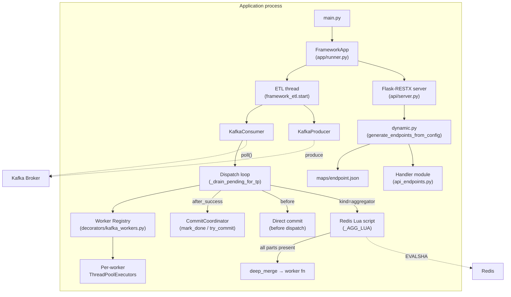

# QF Framework — Technical Documentation

> **Version:** v6
> **Language:** Python 3.12
> **Core dependencies:** kafka-python, Flask-RESTX, Redis, OpenTelemetry

---

## Table of Contents

1. [Overview](#1-overview)
2. [Architecture](#2-architecture)
3. [Worker Registry](#3-worker-registry)
4. [ETL Runtime](#4-etl-runtime)
5. [Policy Decorators](#5-policy-decorators)
6. [Aggregator](#6-aggregator)
7. [Dynamic API](#7-dynamic-api)
8. [Configuration Reference](#8-configuration-reference)
9. [Extension Patterns](#9-extension-patterns)
10. [Known Limitations](#10-known-limitations)

---

## 1. Overview

The QF Framework is a Python library for building high-throughput Kafka ETL workers and dynamic HTTP APIs from a **single application process**. It is designed around the principle that boilerplate is the enemy of maintainability: you declare intent with decorators, and the framework handles all the Kafka plumbing, thread management, offset coordination, and resiliency policy enforcement.

### Design principles

| Principle | What it means in practice |
|---|---|
| Decorator-based worker declaration | Zero boilerplate — one `@kafka_handler` or `@kafka_aggregator` and the worker is fully wired. |
| Per-worker `ThreadPoolExecutor` | Each worker has its own bounded thread pool. No single slow worker can block another. |
| Per-partition backpressure | The consumer pauses individual `TopicPartition`s when their in-memory queue fills, preventing unbounded RAM growth without dropping messages. |
| Runtime-agnostic policy decorators | `@retry_to_dlq`, `@rate_limit`, `@circuit_breaker` attach metadata only. The same decorator can be reused on HTTP handlers, cron jobs, or any other runtime. |
| Redis+Lua aggregation | Multi-topic merge uses an atomic Lua script, making the "all parts arrived" check exactly-once safe across any number of pods sharing the same Redis. |

---

## 2. Architecture

### Component diagram



### Key runtime objects

| Object | Location | Lifecycle |
|---|---|---|
| `FrameworkApp` | `framework/app/runner.py` | Instantiated once in `main.py`; calls `.run()` |
| `FrameworkSettings` | `framework/config/settings.py` | Immutable dataclass passed to `FrameworkApp` |
| `WorkerSpec` | `framework/decorators/kafka_workers.py` | Created at import time by decorators; frozen dataclass |
| `WorkerPool` | `framework/etl/framework_etl.py` | One per registered worker; wraps a `ThreadPoolExecutor` |
| `WorkerState` | `framework/etl/framework_etl.py` | One per registered worker; mutable runtime state (CB counters, rate-limit tokens) |
| `CommitCoordinator` | `framework/etl/framework_etl.py` | Single instance per ETL run; manages sliding-window offset commits |

---

## 3. Worker Registry

**Module:** `src/framework/decorators/kafka_workers.py`

### Module-level registry state

```python
_WORKERS_BY_NAME: Dict[str, WorkerSpec] = {}
_TOPIC_TO_WORKER: Dict[str, str] = {}       # topic → worker name
```

Both are populated at **import time** when Python evaluates the decorator expressions in your worker module. The ETL runtime reads these dictionaries once during `start()`.

### `WorkerSpec` dataclass

`WorkerSpec` is a frozen dataclass that carries everything the runtime needs to process messages for a single worker:

| Field | Type | Default | Description |
|---|---|---|---|
| `kind` | `"handler" \| "aggregator"` | required | Determines dispatch path |
| `name` | `str` | required | Unique worker identifier; used as Kafka consumer `group_id` suffix |
| `topics_in` | `List[str]` | required | Input Kafka topics this worker consumes |
| `topics_out` | `List[str]` | required | Output Kafka topics results are produced to |
| `max_workers` | `int` | `4` | Size of this worker's `ThreadPoolExecutor` |
| `bulk_mode` | `bool` | `False` | If `True`, messages are batched before dispatch |
| `batch_size` | `int` | `1` | Maximum batch size for bulk mode |
| `batch_timeout_ms` | `int` | `200` | Flush a partial batch after this many milliseconds (bulk mode) |
| `aggregate_by` | `Optional[str]` | `None` | Dot-path into the message for the aggregation key (aggregator only) |
| `aggregator_timeout_sec` | `int` | `600` | Redis key TTL for partial aggregation state |
| `metadatas` | `Dict[str, Any]` | `{}` | Arbitrary key-value pairs passed to every call of the worker function |
| `retry_to_dlq` | `Optional[RetryToDlqConfig]` | `None` | Set by `@retry_to_dlq` |
| `circuit_breaker` | `Optional[CircuitBreakerConfig]` | `None` | Set by `@circuit_breaker` |
| `rate_limit` | `Optional[RateLimitConfig]` | `None` | Set by `@rate_limit` |
| `fn` | `Callable` | no-op lambda | The decorated worker function itself |

### `@kafka_handler`

Registers a standard message handler. Supports single-message mode and bulk (batched) mode.

```python
from framework.decorators import kafka_handler, retry_to_dlq

@kafka_handler(
    name="my_worker",
    topics_in=["input.topic"],
    topics_out=["output.topic"],
    max_workers=8,
    bulk_mode=False,
    metadatas={"env": "prod"},
)
@retry_to_dlq(max_attempts=3, dlq_topic="input.topic.dlq")
def my_worker(message: dict, consumer_name: str, metadatas: dict) -> dict:
    # transform message
    return {**message, "processed": True}
```

The decorator reads any policy attributes (`_qsint_retry_to_dlq`, `_qsint_circuit_breaker`, `_qsint_rate_limit`) from the function object **and from its entire `__wrapped__` chain**, so the order of `@kafka_handler` and policy decorators does not matter.

**Bulk mode signature** — the function receives a `list[dict]` instead of a single `dict`:

```python
@kafka_handler(
    name="my_bulk_worker",
    topics_in=["input.bulk.topic"],
    topics_out=["output.bulk.topic"],
    max_workers=4,
    bulk_mode=True,
    batch_size=100,
    batch_timeout_ms=500,
)
def my_bulk_worker(messages: list[dict], consumer_name: str, metadatas: dict) -> list[dict]:
    return [process(m) for m in messages]
```

### `@kafka_aggregator`

Registers a multi-topic aggregator. Requires `len(topics_in) >= 2`.

```python
@kafka_aggregator(
    name="my_aggregator",
    topics_in=["topic.a", "topic.b"],
    topics_out=["topic.merged"],
    aggregate_by="id",           # dot-path into message; falls back to message["id"]
    aggregator_timeout_sec=3600,
    max_workers=4,
)
def my_aggregator(merged: dict, consumer_name: str, metadatas: dict) -> dict:
    return {**merged, "aggregated": True}
```

### Enforcement rules

`register_worker()` enforces these invariants at import time and raises immediately on violation:

- **Duplicate worker name** — `RuntimeError: Duplicate worker name '<name>'`
- **Duplicate topic** — `RuntimeError: Topic '<t>' already handled by '<other>'`. Exactly one worker per topic is a hard constraint.
- **Missing `topics_in` or `topics_out`** — `ValueError`
- **`bulk_mode=True` with `batch_size < 2`** — `ValueError`
- **Aggregator with `len(topics_in) < 2`** — `ValueError`
- **Aggregator missing `aggregate_by`** — `ValueError`

### Aggregate key resolution

`compute_aggregate_key(spec, message)` resolves the key used to group partial messages in Redis:

1. If `spec.aggregate_by` is set, walks the dot-path into the message (e.g., `"order.id"` reads `message["order"]["id"]`).
2. If the path resolves to a non-None value, that value (stringified) is the key.
3. Otherwise falls back to `message["id"]`, auto-generating a UUID if absent.

---

## 4. ETL Runtime

**Module:** `src/framework/etl/framework_etl.py`

### Startup sequence

`start(worker_modules, bootstrap_servers, consumer_name)` performs these steps in order:

1. **Import worker modules** — calls `importlib.import_module` for each module path in `worker_modules`. This triggers all `@kafka_handler`/`@kafka_aggregator` decorator executions, populating the registry.
2. **Collect topics** — calls `all_topics()` to get the sorted union of all `topics_in` from every registered worker.
3. **Create `KafkaConsumer`** — subscribes to all topics, `enable_auto_commit=False`, `group_id=Config.WORKER_NAME`. Retries up to `KAFKA_CONNECT_RETRIES` times.
4. **Create `KafkaProducer`** — tuned for throughput (`linger_ms`, `batch_size`, async by default). Retries similarly.
5. **Create per-worker `ThreadPoolExecutor`** — `WorkerPool.create(name, max_workers)` for each registered worker.
6. **Create per-worker `WorkerState`** — mutable state for circuit breaker counters and rate-limit token buckets.
7. **Load Redis Lua script** — calls `redis.script_load(_AGG_LUA)` to get a `sha` for `EVALSHA`.
8. **Enter main poll loop.**

### Main poll loop

Each iteration of the `while True` loop:

1. **Drain pending first** — for every assigned `TopicPartition`, call `_drain_pending_for_tp`. This attempts to submit jobs from the in-memory queue to the worker pool before fetching new records from Kafka.

2. **Handle resume conditions** — for each paused TP, check if the pause reason has cleared:
   - `circuit_breaker_open`: resume when `time.time() >= state.open_until_ts`
   - `rate_limited`: resume when `pause_until[tp]` has elapsed (typically 50 ms)
   - `pending_full`: resume when `len(pending[tp]) < pending_max_per_tp`

3. **`consumer.poll(timeout_ms, max_records)`** — fetches a batch of records grouped by `TopicPartition`. Paused TPs are excluded from poll results by the Kafka client.

4. **Idle path** — if poll returns no records, call `coordinator.try_commit()` then sleep `KAFKA_IDLE_SLEEP_SEC`.

5. **Enqueue new records** — for each `(tp, messages)` pair:
   - Look up the `WorkerSpec` for `tp.topic`.
   - Append each `PendingItem(offset, raw_json, enqueue_ts)` to `pending[tp]`.
   - If the queue reaches `pending_max_per_tp` before all records are enqueued, call `_pause_and_seek_backlog` to pause the TP and `consumer.seek` back to the first unenqueued offset. This ensures those messages are re-delivered when the TP resumes.

6. **`_drain_pending_for_tp` again** — immediately drain after enqueue for low-latency processing.

7. **`coordinator.try_commit()`** — tick-batched commit flush.

### Dispatch modes

#### Single handler

One job per message. The worker function signature is:

```python
def my_worker(message: dict, consumer_name: str, metadatas: dict) -> dict | list | None:
    ...
```

A `None` return means the message was intentionally filtered; the offset is committed but nothing is produced.

#### Bulk handler (strict batching)

A batch is considered "ready" when either:
- `len(pending[tp]) >= batch_size`, OR
- the oldest item in the queue is older than `batch_timeout_ms` milliseconds.

Both conditions are evaluated on every tick, so batches are always time-bounded. The worker function receives the full batch as `list[dict]`.

#### Aggregator

See [Section 6](#6-aggregator).

### CommitCoordinator (`after_success` strategy)

`CommitCoordinator` maintains a per-`TopicPartition` sliding window:

```
next_commit[tp]  — the lowest offset not yet committed
done[tp]         — set of offsets that have completed successfully
```

**`init_tp(tp, first_offset)`** — called at dispatch time (before the worker thread starts), recording the lowest in-flight offset. This anchors `next_commit` correctly regardless of which offset finishes first.

**`mark_done(tp, offset)`** — called by the worker thread when a job succeeds. Adds the offset to `done[tp]`.

**`try_commit(force=False)`** — advances the sliding window:
1. Skips if `(now - last_commit_ts) < commit_tick_sec` (batches commits to reduce broker round-trips).
2. For each TP: walks `next_commit[tp]` forward as long as consecutive offsets are in `done[tp]`.
3. Commits only TPs where `next_commit` actually advanced.

This guarantees that offsets are committed in order and only after successful processing, providing **at-least-once** delivery semantics.

#### `before` strategy

When `KAFKA_COMMIT_STRATEGY=before`, offsets are committed by kafka-python's automatic commit mechanism (`enable_auto_commit=True`). This is **at-most-once** — messages may be lost on process crash between commit and processing.

### Backpressure mechanism

```
pending[tp]: deque with at most pending_max_per_tp items
```

- When `len(pending[tp]) >= pending_max_per_tp` AND the worker pool has no free slots: `_pause(tp, "pending_full")`.
- When `len(pending[tp]) < pending_max_per_tp`: `_resume(tp, "pending_has_room")`.
- On pause, if records were already polled but not enqueued, `consumer.seek(tp, first_unenqueued_offset)` rewinds so they are not lost.

The hysteresis threshold for resume is `pending_max_per_tp` (the full capacity), not half. This avoids thrashing. In practice the queue drains quickly once the pool has slots.

### Rate limiting (dispatch-granular token bucket)

Rate limiting is applied **per dispatched job**, not per poll tick:

```python
def _take_dispatch_token() -> bool:
    if not spec.rate_limit:
        return True
    if rl_try_take(state, spec.rate_limit, amount=1.0):
        return True
    _pause(tp, "rate_limited", retry_in_sec=0.05)
    return False
```

`rl_try_take` refills tokens proportional to time elapsed since last refill (`elapsed * rps`) and deducts 1.0 token per call. The TP is paused for 50 ms when the bucket is empty, preventing a busy-spin.

In bulk mode, one token is consumed per **batch dispatch** (not per message in the batch). Account for this when choosing `rps`.

### Circuit breaker

`WorkerState` tracks:
- `consecutive_failures: int` — incremented on every exception from the worker function.
- `open_until_ts: float` — epoch timestamp until which the breaker is open (pausing the TP).

```
cb_on_failure: consecutive_failures >= cfg.failures → open_until_ts = now + reset_sec
cb_on_success: consecutive_failures = 0
cb_is_open:    now < open_until_ts
```

When the breaker opens, all TPs handled by that worker are paused. New records continue to be enqueued in the pending queue (up to `pending_max_per_tp`), so messages are not lost during the open window.

---

## 5. Policy Decorators

**Module:** `src/framework/decorators/policies.py`

### Design: metadata-only decoration

Policy decorators do **not** wrap the function call. They attach typed configuration objects as attributes on the function object:

| Attribute | Type | Set by |
|---|---|---|
| `_qsint_retry_to_dlq` | `RetryToDlqConfig` | `@retry_to_dlq` |
| `_qsint_circuit_breaker` | `CircuitBreakerConfig` | `@circuit_breaker` |
| `_qsint_rate_limit` | `RateLimitConfig` | `@rate_limit` |

The ETL runtime reads these attributes from `WorkerSpec` (which mirrors them from the function at registration time) and applies the policy logic itself. This means:

- The same worker function can be called directly (e.g., from an HTTP handler) without the policy side-effects.
- Policy decorators work on any callable, not just Kafka workers.
- Decorator order is irrelevant — `_attach()` walks the `__wrapped__` chain and also calls `update_registered_worker_policy()` to retroactively update an already-registered `WorkerSpec`.

### `@retry_to_dlq`

```python
@retry_to_dlq(
    max_attempts=3,            # total attempts before routing to DLQ
    dlq_topic="my.dlq",        # topic for exhausted messages
    retry_count_field="retry_count",  # message field tracking attempt number
)
```

**Runtime behavior** (`_handle_retry_to_dlq`):

1. Read `message[retry_count_field]` (defaults to `0` if absent).
2. Increment by 1 and write back into the message.
3. If `new_count < max_attempts`: synchronously produce (`_send_sync`) back to the **original input topic** with the incremented counter. The message will be re-consumed in a future poll.
4. If `new_count >= max_attempts`: synchronously produce to `dlq_topic`.
5. Returns `True` if the send succeeded (offset may be committed); `False` if the send failed (offset should not be committed, preventing message loss).

**No `@retry_to_dlq` decorator (legacy path):** The message is sent synchronously to `Config.ERROR_TOPIC`, and the offset is committed.

### `@rate_limit`

```python
@rate_limit(
    rps=100.0,   # tokens refilled per second
    burst=100,   # maximum token bucket capacity (defaults to int(rps) if not set)
)
```

`RetryToDlqConfig` fields: `rps: float = 10.0`, `burst: int = 10`.

### `@circuit_breaker`

```python
@circuit_breaker(
    failures=5,    # consecutive failures before opening
    reset_sec=30,  # seconds the breaker stays open
)
```

`CircuitBreakerConfig` fields: `failures: int = 5`, `reset_sec: int = 30`.

### `read_policy_metadata(fn)`

A utility for non-Kafka runtimes to introspect policy config from any decorated callable:

```python
from framework.decorators.policies import read_policy_metadata

meta = read_policy_metadata(my_fn)
# meta = {"retry_to_dlq": RetryToDlqConfig(...), "rate_limit": RateLimitConfig(...)}
```

---

## 6. Aggregator

**Module:** `src/framework/etl/framework_etl.py` (`_run_aggregator`, `_AGG_LUA`)
**Redis support:** `src/framework/redis/redis_utils.py` (`RedisUtils`, `RedisSingleton`)

### How it works

An aggregator collects one message from each of its `topics_in` and dispatches to the worker function only when **all parts have arrived**. The state is stored in Redis, making the completion check atomic and safe across multiple pods consuming the same topics.

#### Step-by-step flow

1. An incoming message arrives on one of the aggregator's `topics_in` (e.g., `topic.a`).
2. `compute_aggregate_key(spec, message)` resolves the grouping key (e.g., `message["id"] = "order-42"`).
3. The Redis key is `agg:{worker_name}:{aggregate_key_value}` (e.g., `agg:my_aggregator:order-42`).
4. The Lua script `_AGG_LUA` is executed atomically (`EVALSHA`):

```lua
-- KEYS[1] = Redis hash key
-- ARGV[1] = topic name (field name within the hash)
-- ARGV[2] = JSON-serialized message
-- ARGV[3] = TTL in seconds
-- ARGV[4] = expected number of parts (len(topics_in))

redis.call('HSET', KEYS[1], ARGV[1], ARGV[2])
redis.call('EXPIRE', KEYS[1], tonumber(ARGV[3]))
local n = redis.call('HLEN', KEYS[1])
if n == tonumber(ARGV[4]) then
  local all = redis.call('HGETALL', KEYS[1])
  return all
end
return {}
```

5. If the hash has fewer than `len(topics_in)` fields, the script returns an empty list. The offset is committed; no worker dispatch.
6. When all parts are present, the script returns all field values. The runtime does **not** immediately delete the key — it deletes it after the worker function succeeds (`redis_client.delete(agg_key)`), providing idempotency on retry.
7. `_aggregate_merge` performs a `deep_merge` of all partial messages in arrival order.
8. The merged dict is passed to the worker function.

### Exactly-once merge guarantee

Because `HSET` + `HLEN` + `HGETALL` are a single Lua transaction, two pods processing the last two parts concurrently cannot both see `HLEN == expected`. Only one will observe the complete hash; the other will get an empty result and skip dispatch.

### Aggregator example

```python
from framework.decorators import kafka_aggregator

@kafka_aggregator(
    name="order_enrichment",
    topics_in=["orders.created", "orders.payment"],
    topics_out=["orders.enriched"],
    aggregate_by="id",            # both topics must carry the same "id" field
    aggregator_timeout_sec=3600,  # partial state expires after 1 hour
    max_workers=8,
)
def order_enrichment(merged: dict, consumer_name: str, metadatas: dict) -> dict:
    """Called once per order when both the creation event and payment event have arrived."""
    return {**merged, "fully_enriched": True}
```

A message on `orders.created` with `{"id": "order-42", "item": "book"}` and a message on `orders.payment` with `{"id": "order-42", "amount": 29.99}` will produce a merged call with `{"id": "order-42", "item": "book", "amount": 29.99}`.

### RedisUtils and RedisSingleton

`RedisUtils` is a thin wrapper around `redis.StrictRedis`. `RedisSingleton` ensures a single connection is reused throughout the process (thread-safe double-checked locking). The ETL runtime accesses the underlying client directly (`redis_util.redis`) to call `script_load` and `evalsha`.

---

## 7. Dynamic API

**Module:** `src/framework/api/dynamic.py`
**Configuration:** `maps/endpoint.json`

### How endpoint generation works

`generate_endpoints_from_config(api, path)` reads a single JSON file and builds a fully wired Flask-RESTX API from it. No Python code changes are needed to add or remove endpoints.

The steps:

1. Load `maps/endpoint.json` via `load_json(path)`.
2. For each entry in `config["namespaces"]`: create a `flask_restx.Namespace` and register it on the `Api` object.
3. For each entry in `config["endpoints"]`:
   a. Resolve the `Namespace` by name.
   b. Optionally build a `flask_restx.fields` model from `config["models"][model_name]` (used for Swagger documentation and optional request validation on POST/PUT).
   c. Call `create_method(ns, method, exec_method, operation_name, model)` to generate a handler function.
   d. Use `type(...)` to dynamically build a `Resource` subclass with the generated method attached.
   e. Compute the relative URL within the namespace (strips the namespace prefix from `api_url`).
   f. Register the resource with `ns.add_resource`.
4. The generated handler calls `reactor(fun, request, operation, **kwargs)`, which calls `fun(app=current_app, operation=operation, request=request, **kwargs)`. `fun` is the handler function resolved from the specified module.

### `endpoint.json` structure

```json
{
  "namespaces": [
    {
      "name": "workers",
      "description": "Workers exposed via HTTP"
    }
  ],
  "models": {
    "NerRequest": {
      "text": {"type": "string", "args": {"required": true, "description": "Input text"}},
      "lang": {"type": "string", "args": {"required": false}}
    },
    "Empty": {}
  },
  "endpoints": [
    {
      "namespace": "workers",
      "operation_name": "ner",
      "model_name": "NerRequest",
      "request_method": ["POST"],
      "api_url": "/workers/ner",
      "exec_method": {
        "module_name": "api_endpoints",
        "method_name": "worker_ner"
      }
    }
  ]
}
```

**Field reference:**

| Field | Required | Description |
|---|---|---|
| `namespace` | yes | Must match a name in `namespaces` |
| `operation_name` | yes | Unique within the namespace; becomes the Flask endpoint name |
| `model_name` | yes | Key in `models`; use `"Empty"` (or `{}`) for no request model |
| `request_method` | yes | Array of HTTP methods: `["GET"]`, `["POST"]`, `["GET", "POST"]`, etc. |
| `api_url` | no | Full URL path; namespace prefix is stripped automatically |
| `exec_method.module_name` | yes | Python module to import (must be on `sys.path`) |
| `exec_method.method_name` | yes | Callable in that module |

### Handler function signature

```python
def worker_ner(app, operation: str, request, **kwargs):
    """
    app       — Flask application context (current_app)
    operation — operation_name from endpoint.json
    request   — Flask request object
    **kwargs  — URL path parameters (e.g., <int:id>)
    """
    payload = request.get_json(force=True)
    result = my_worker_fn(payload, consumer_name="api", metadatas={})
    return jsonify(result)
```

### Supported model field types

| `type` value | Flask-RESTX field |
|---|---|
| `"string"` | `fields.String` |
| `"boolean"` | `fields.Boolean` |
| `"integer"` | `fields.Integer` |
| `"list"` | `fields.List` (with `super` specifying the element type) |
| `"dict"` | `fields.Raw` |
| anything else | `fields.String` |

---

## 8. Configuration Reference

Configuration is read from environment variables by `config.Config` in the application. All keys have defaults suitable for local development.

### Kafka consumer / identity

| Key | Default | Description |
|---|---|---|
| `WORKER_NAME` | `"poc-workers-app"` | Kafka consumer `group_id`. Also used as the OpenTelemetry service name fallback. |
| `KAFKA_BOOTSTRAP_SERVERS` | `"localhost:9094"` | Comma-separated list of Kafka broker addresses. |
| `ERROR_TOPIC` | `"poc.dlq"` | Topic for messages with no matching worker spec, or with no `@retry_to_dlq` decorator on exception. |

### Commit semantics

| Key | Default | Values | Description |
|---|---|---|---|
| `KAFKA_COMMIT_STRATEGY` | `"before"` | `"before"`, `"after_success"` | `"before"`: at-most-once (Kafka auto-commit). `"after_success"`: at-least-once via `CommitCoordinator`. |

### Poll tuning

| Key | Default | Production guidance | Description |
|---|---|---|---|
| `KAFKA_POLL_TIMEOUT_MS` | `1` | `100–250` | Max time `consumer.poll()` blocks when no records are immediately available. Lower = lower idle latency but higher CPU. |
| `KAFKA_POLL_MAX_RECORDS` | `200` | `1000–5000` | Max records returned by a single `poll()` call across all partitions. |
| `KAFKA_IDLE_SLEEP_SEC` | `0` | `0.01–0.05` | Extra sleep when `poll()` returns empty. Combined with `KAFKA_POLL_TIMEOUT_MS` controls idle CPU usage. |

### Commit / dispatch tuning

| Key | Default | Production guidance | Description |
|---|---|---|---|
| `KAFKA_COMMIT_TICK_SEC` | `0.2` | `0.5–2.0` | Minimum interval between `CommitCoordinator` flush calls. Batches broker round-trips. |
| `KAFKA_MAX_JOBS_PER_TP_PER_TICK` | `20` | `200–1000` | Max jobs dispatched from one `TopicPartition` per scheduler tick. Controls fairness across partitions. |
| `KAFKA_PENDING_MAX_PER_TP` | `750` | `750–5000` | Maximum in-memory queue depth per `TopicPartition`. Triggers backpressure (pause + seek) when reached. Rule of thumb: `>= batch_size * 2` for bulk workers. |

### Kafka connect retry

| Key | Default | Description |
|---|---|---|
| `KAFKA_CONNECT_RETRIES` | `10` | Attempts to connect consumer/producer before raising. |
| `KAFKA_CONNECT_RETRY_SLEEP_SEC` | `5` | Seconds between connection retry attempts. |

### Kafka producer

| Key | Default | Description |
|---|---|---|
| `KAFKA_PRODUCER_ACKS` | `1` | Required broker acknowledgements (`0`, `1`, or `"all"`). |
| `KAFKA_PRODUCER_LINGER_MS` | `5` | Producer-side batching delay in milliseconds. |
| `KAFKA_PRODUCER_BATCH_SIZE` | `65536` | Producer send buffer size in bytes (64 KB). |
| `KAFKA_BULK_OUTPUT_SYNC` | `True` | When `True`, bulk handlers wait for broker ACKs before marking offsets done. Correct but slower under high `max_workers`. |

### Redis

| Key | Default | Description |
|---|---|---|
| `REDIS_HOST` | `"localhost"` | Redis server hostname. |
| `REDIS_PORT` | `"6379"` | Redis server port. |
| `REDIS_DB` | `"0"` | Redis logical database index. |
| `REDIS_MAX_CONNECTIONS` | `"50"` | Connection pool size cap. Set to at least your highest `max_workers` value. |
| `REDIS_SOCKET_TIMEOUT` | `"5.0"` | Seconds before a Redis command raises `TimeoutError` instead of blocking. |
| `REDIS_CONNECT_TIMEOUT` | `"5.0"` | Seconds before a new connection attempt raises `TimeoutError`. |
| `REDIS_RETRY_ON_TIMEOUT` | `"true"` | Retry the command once on timeout (`true`/`false`). Safe for Lua scripts (idempotent). |

**Connection pool design:** `RedisSingleton` creates a `redis.ConnectionPool` so each worker thread gets its own socket from the pool for the duration of a command, avoiding the serialization of a shared single socket. `socket_keepalive=True` is always enabled to prevent stale connections on long-idle pools.

### API server

| Key | Default | Description |
|---|---|---|
| `API_HOST` | `"0.0.0.0"` | Flask listen address (via `FrameworkSettings.api_host`). |
| `API_PORT` | `5000` | Flask listen port. |

### Configuration profiles (copy-paste presets)

The following presets are embedded as comments in `framework_etl.py` and represent validated tuning profiles:

**DEV (fast feedback, acceptable CPU):**
```
KAFKA_POLL_TIMEOUT_MS=50
KAFKA_IDLE_SLEEP_SEC=0.01
KAFKA_POLL_MAX_RECORDS=1000
KAFKA_PENDING_MAX_PER_TP=500
KAFKA_MAX_JOBS_PER_TP_PER_TICK=150
```

**PROD balanced (good throughput, controlled CPU):**
```
KAFKA_POLL_TIMEOUT_MS=200
KAFKA_IDLE_SLEEP_SEC=0.02
KAFKA_POLL_MAX_RECORDS=2000
KAFKA_PENDING_MAX_PER_TP=1500
KAFKA_MAX_JOBS_PER_TP_PER_TICK=300
```

**PROD low-latency (more CPU, quicker reaction when idle):**
```
KAFKA_POLL_TIMEOUT_MS=100
KAFKA_IDLE_SLEEP_SEC=0.005
KAFKA_POLL_MAX_RECORDS=2000
KAFKA_PENDING_MAX_PER_TP=1500
KAFKA_MAX_JOBS_PER_TP_PER_TICK=500
```

**PROD mostly-idle topics (minimum CPU, higher wake-up latency):**
```
KAFKA_POLL_TIMEOUT_MS=500
KAFKA_IDLE_SLEEP_SEC=0.1
KAFKA_POLL_MAX_RECORDS=500
KAFKA_PENDING_MAX_PER_TP=500
KAFKA_MAX_JOBS_PER_TP_PER_TICK=100
```

---

## 9. Extension Patterns

### Adding a new Kafka worker

No changes to framework code are needed. The framework discovers workers entirely through the decorator registry.

1. Define your function with `@kafka_handler` (or `@kafka_aggregator`) in any Python module:

```python
# src/workers/my_new_worker.py
from framework.decorators import kafka_handler, retry_to_dlq

@kafka_handler(
    name="invoice_processor",
    topics_in=["invoices.raw"],
    topics_out=["invoices.processed"],
    max_workers=12,
)
@retry_to_dlq(max_attempts=3, dlq_topic="invoices.dlq")
def invoice_processor(message: dict, consumer_name: str, metadatas: dict) -> dict:
    # your logic here
    return {**message, "status": "processed"}
```

2. Add the module path to `worker_modules` in your `FrameworkSettings` (or `Config.WORKER_MODULE`):

```python
settings = FrameworkSettings(
    worker_modules=["workers.workers", "workers.my_new_worker"],
    ...
)
```

3. Restart the application. The new topics are automatically included in the consumer subscription.

### Adding a new HTTP endpoint

1. Add a handler function to `api_endpoints.py` (or any module on `sys.path`):

```python
def worker_invoice(app, operation, request, **kwargs):
    payload = request.get_json(force=True)
    result = invoice_processor(payload, consumer_name="api", metadatas={"via": "http"})
    return jsonify(result)
```

2. Add an entry to `maps/endpoint.json`:

```json
{
  "namespace": "workers",
  "operation_name": "invoice",
  "model_name": "Empty",
  "request_method": ["POST"],
  "api_url": "/workers/invoice",
  "exec_method": {
    "module_name": "api_endpoints",
    "method_name": "worker_invoice"
  }
}
```

3. Restart the application. The endpoint appears in Swagger UI automatically.

### Chaining workers (pipeline pattern)

Workers are chained by making the `topics_out` of one worker overlap with the `topics_in` of the next. No explicit wiring is needed.

```
Worker A: topics_in=["raw.data"]       topics_out=["enriched.data"]
Worker B: topics_in=["enriched.data"]  topics_out=["final.output"]
```

Worker B's consumer group will consume the messages that Worker A produces to `enriched.data`. Both workers can run in the same process (sharing one `KafkaConsumer`) or in separate processes — the Kafka topic is the decoupling boundary.

### Combining policy decorators

Policies compose by stacking decorators. Decorator order does not matter due to the `__wrapped__`-chain traversal:

```python
@kafka_handler(
    name="sensitive_worker",
    topics_in=["sensitive.in"],
    topics_out=["sensitive.out"],
    max_workers=4,
)
@retry_to_dlq(max_attempts=3, dlq_topic="sensitive.dlq")
@circuit_breaker(failures=5, reset_sec=60)
@rate_limit(rps=50, burst=50)
def sensitive_worker(message: dict, consumer_name: str, metadatas: dict) -> dict:
    ...
```

---

## 10. Known Limitations

### One worker per topic (by design)

`_TOPIC_TO_WORKER` enforces a strict 1:1 mapping. If two `@kafka_handler` declarations list the same topic, the second import raises `RuntimeError` at startup. This is intentional: it prevents split-brain processing and makes message routing unambiguous. To fan out, produce to multiple `topics_out` from a single worker.

### `KAFKA_BULK_OUTPUT_SYNC=True` with high `max_workers` causes producer contention

When `KAFKA_BULK_OUTPUT_SYNC=True`, every bulk worker thread calls `_wait_futures(futures, timeout_sec=...)` after producing its batch. `kafka-python`'s `KafkaProducer` uses a shared internal sender thread and a shared socket. Under high concurrency (large `max_workers`), many threads blocking on `future.get()` simultaneously can cause:

- Producer sender thread contention
- ACK timeouts under back-pressure
- Reduced effective throughput

**Mitigation:** Reduce `max_workers` for bulk workers, or set `KAFKA_BULK_OUTPUT_SYNC=False` if at-least-once output delivery is not required for your use case.

### `commit_strategy="before"` is at-most-once

When using Kafka auto-commit (`KAFKA_COMMIT_STRATEGY=before`), offsets are committed before (or independently of) message processing. A process crash between commit and successful processing will result in **message loss** — the messages will not be re-delivered. Use `after_success` for at-least-once guarantees.

### Circuit breaker tracks consecutive failures globally per worker, not per partition

`WorkerState.consecutive_failures` is a single counter shared across all `TopicPartition`s handled by a worker. A failure on partition 0 increments the same counter as a failure on partition 7. When the breaker opens, **all** partitions of that worker are paused, not only the partition that experienced failures. This can cause unnecessary latency on healthy partitions when a single partition is producing bad messages.

**Workaround:** Set a high `failures` threshold to reduce sensitivity, or ensure DLQ routing via `@retry_to_dlq` so persistent bad messages are quickly evacuated before the breaker trips.

### No graceful shutdown

`FrameworkApp.shutdown()` logs a warning and does nothing. The ETL thread is a daemon thread — it is terminated by process exit. In-flight jobs in worker `ThreadPoolExecutor`s are not drained, and any pending `CommitCoordinator` state is lost. Messages in-flight will be reprocessed after restart under `after_success` commit strategy (at-least-once), or lost under `before` (at-most-once).

### Redis `RedisSingleton` ignores re-initialization arguments

`RedisSingleton.__new__` is a class-level singleton. If `RedisUtils` is instantiated multiple times with different `host`/`port`/`db` arguments, only the first set of arguments takes effect. All subsequent instantiations return the same underlying connection.
