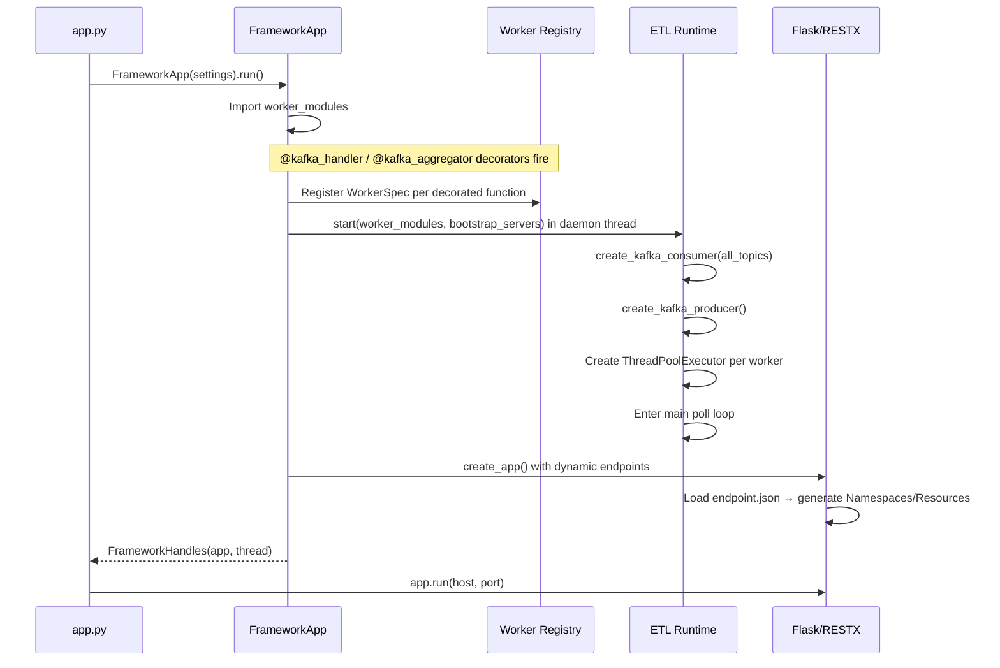
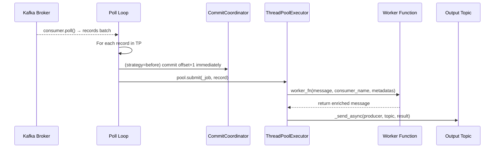
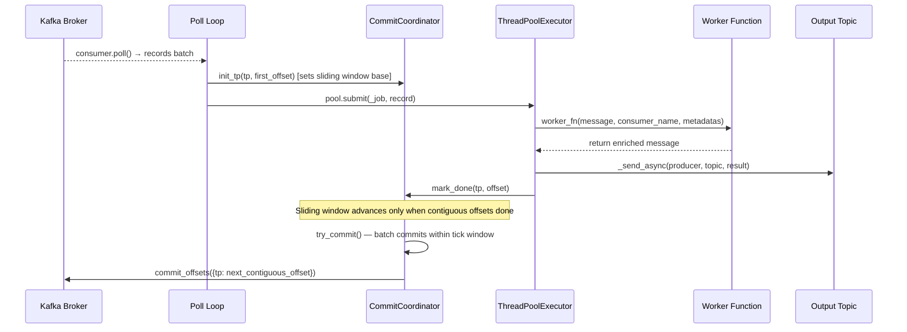
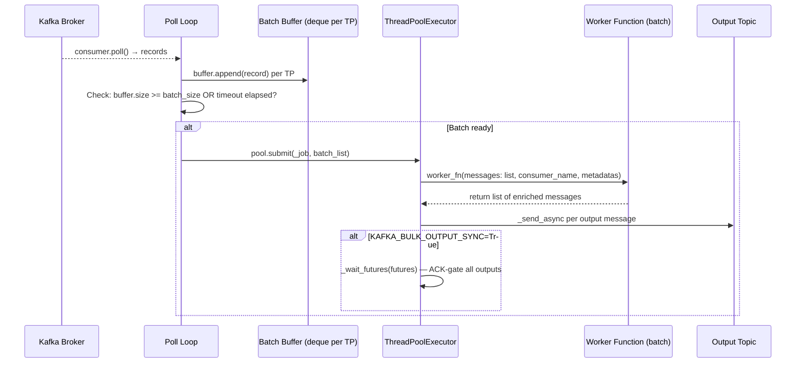
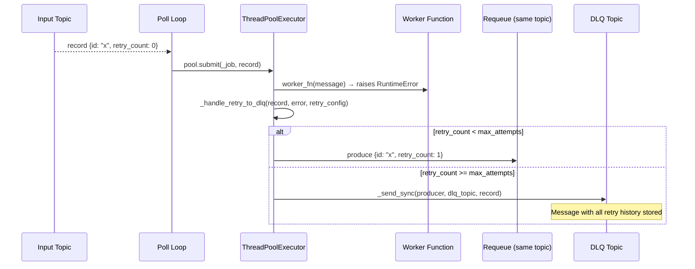
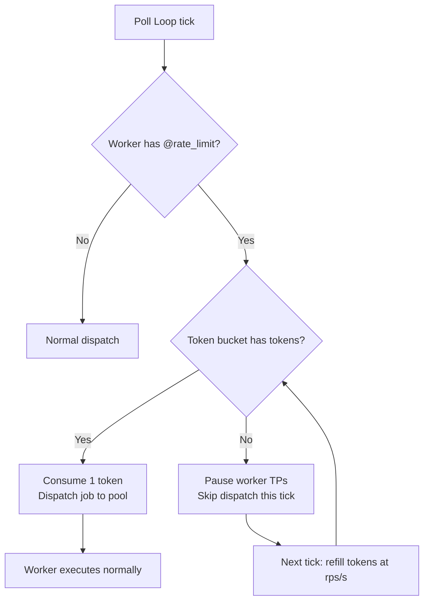
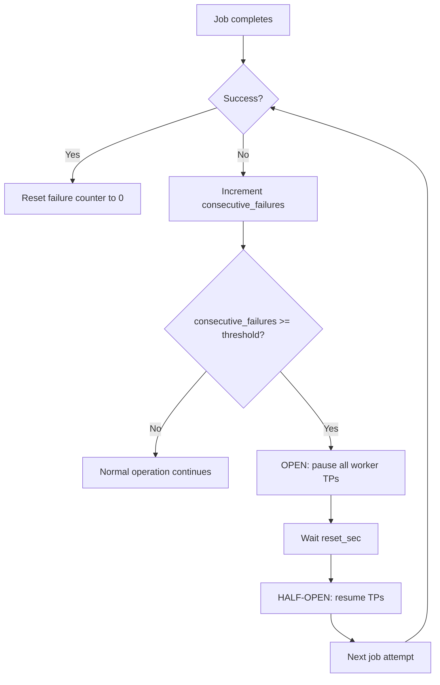
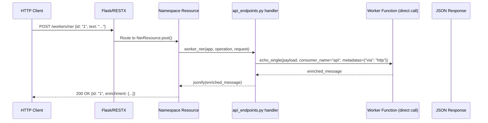
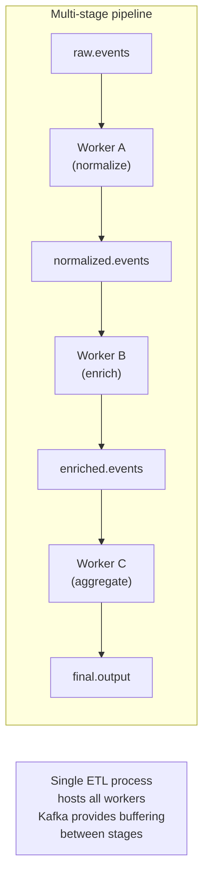

# QF Framework — Operational Flows

All major execution paths illustrated with Mermaid diagrams.

---

## 1. Application Startup



---

## 2. Kafka Message — Single Worker (commit_strategy="before")



---

## 3. Kafka Message — Single Worker (commit_strategy="after_success")



---

## 4. Kafka Message — Bulk Worker



---

## 5. Aggregator Flow (Redis + Lua)

```mermaid
sequenceDiagram
    participant KA as Topic A
    participant KB as Topic B
    participant Poll as Poll Loop
    participant Redis as Redis (Lua script)
    participant Pool as ThreadPoolExecutor
    participant W as Aggregator Function
    participant Out as Output Topic

    KA-->>Poll: record {id: "x", part: "a", val_a: 1}
    Poll->>Redis: HSET agg_basic:x part_a={...}; check all parts present?
    Redis-->>Poll: incomplete (missing part_b) → None

    KB-->>Poll: record {id: "x", part: "b", val_b: 10}
    Poll->>Redis: HSET agg_basic:x part_b={...}; check all parts present?
    Redis-->>Poll: COMPLETE → merged = deep_merge(part_a, part_b); DEL key
    Poll->>Pool: pool.submit(_job, merged_record)
    Pool->>W: worker_fn(merged, consumer_name, metadatas)
    W-->>Pool: return enriched merged record
    Pool->>Out: _send_async(producer, out_topic, result)
```

---

## 6. Retry to DLQ Flow



---

## 7. Rate Limit Flow



---

## 8. Circuit Breaker Flow



---

## 9. HTTP API Request Flow



---

## 10. Backpressure Mechanism

```mermaid
flowchart LR
    subgraph "Per-worker backpressure"
        A[Poll records] --> B{pending_jobs[tp] >= MAX?}
        B -- Yes --> C[consumer.pause(tp)\nSkip dispatching]
        B -- No --> D[Dispatch to pool]
        D --> E[Job completes]
        E --> F{pending_jobs[tp] < MAX/2?}
        F -- Yes --> G[consumer.resume(tp)]
        F -- No --> H[Keep paused]
    end
```

---

## 11. Worker Chaining (Pipeline Pattern)



---

## 12. Full System Overview

```mermaid
flowchart TB
    subgraph "External"
        P[Producers / upstream services]
        C[Consumers / downstream services]
        HC[HTTP Clients]
    end

    subgraph "Docker Infrastructure"
        K[Kafka:9094]
        KUI[kafka-ui:8081]
        R[Redis:6379]
        PG[Postgres:5432]
    end

    subgraph "QF App Process"
        subgraph "ETL Thread (daemon)"
            EL[Poll Loop]
            REG[Worker Registry]
            CC[CommitCoordinator]
            subgraph "Workers"
                WE[echo_single pool×100]
                WEB[echo_bulk pool×100]
                WA[agg_basic pool×100]
                WR[retry_single pool×100]
                WRL[rl_single pool×100]
                WRB[rl_bulk pool×100]
            end
        end
        subgraph "HTTP Server (main thread)"
            FL[Flask:5000]
            SW[/swagger-ui]
        end
    end

    P --> K
    K --> EL
    EL --> REG
    REG --> WE & WEB & WA & WR & WRL & WRB
    WA <--> R
    WE & WEB & WA & WR & WRL & WRB --> K
    K --> C
    EL --> CC
    CC --> K

    HC --> FL
    FL --> WE & WRL & WA

    KUI -.-> K
```
