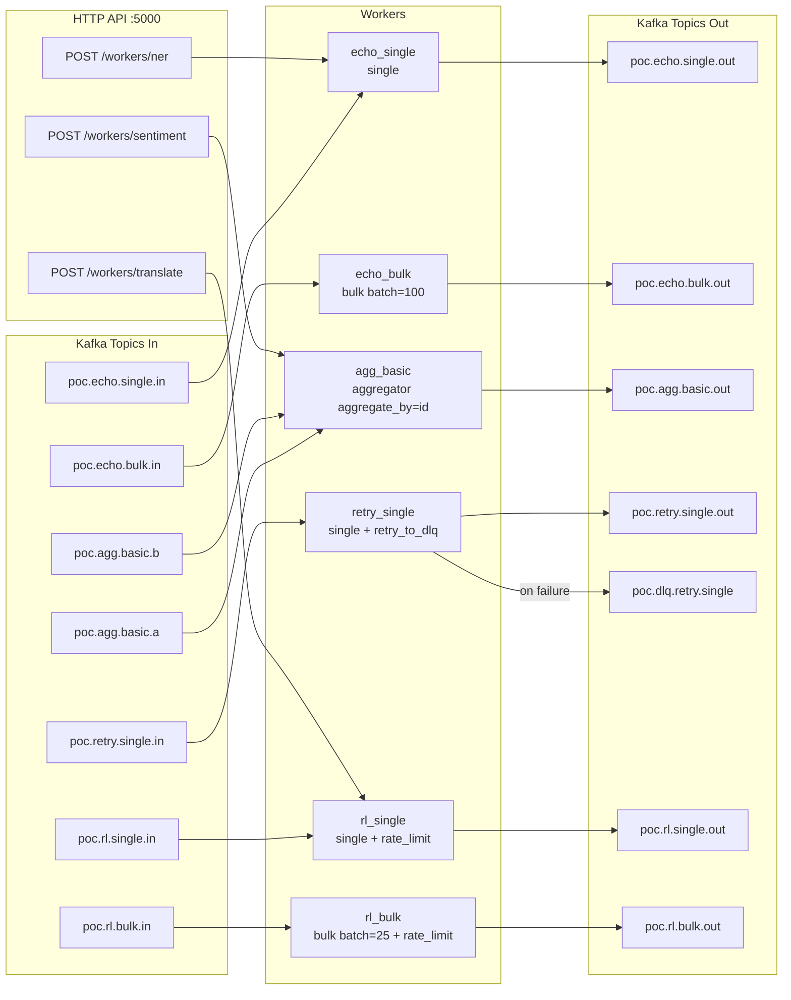

# POC Application — QF Framework

A proof-of-concept demonstrating a multi-worker Kafka + HTTP application built on the **QF Framework**. It runs 6 active workers covering single-message processing, bulk batching, distributed aggregation, retry/DLQ policies, and rate limiting — all exposed simultaneously over Kafka and HTTP.

---

## Table of Contents

- [Overview](#overview)
- [Architecture](#architecture)
- [Quickstart](#quickstart)
- [Worker Reference](#worker-reference)
- [HTTP API](#http-api)
- [Configuration](#configuration)
- [Infrastructure Services](#infrastructure-services)
- [Running Tests](#running-tests)
- [Performance Results](#performance-results)

---

## Overview

| Aspect | Detail |
|---|---|
| Framework | QF Framework (parent directory) |
| Workers | 6 active (echo_single, echo_bulk, agg_basic, retry_single, rl_single, rl_bulk) |
| Transport | Apache Kafka (KRaft, no ZooKeeper) |
| HTTP layer | Dynamic API served on port 5000 |
| Policies demonstrated | `@retry_to_dlq`, `@rate_limit` |
| Supporting services | Redis, PostgreSQL |

The POC covers the following runtime modes:

- **Single** — one message in, one message out
- **Bulk** — batched processing with configurable `batch_size` and `timeout`
- **Aggregator** — merges messages from two input topics before processing

---

## Architecture



---

## Quickstart

**1. Start infrastructure dependencies**

```bash
cd poc_app && docker compose up -d
```

**2. Create and activate a virtual environment, then install dependencies**

```bash
python -m venv venv
source venv/bin/activate
pip install -r requirements.txt
pip install -r ../requirements.txt
```

**3. Copy and review the environment file**

```bash
cp .env.example .env
```

Edit `.env` as needed (see [Configuration](#configuration)).

**4. Run the application**

```bash
python app.py
```

The Kafka workers start consuming immediately. The HTTP API is available at `http://localhost:5000`.

---

## Worker Reference

| Name | Mode | Topics In | Topics Out | Policies | Description |
|---|---|---|---|---|---|
| `echo_single` | single | `poc.echo.single.in` | `poc.echo.single.out` | — | Echoes each message as-is |
| `echo_bulk` | bulk (batch_size=100, timeout=1000ms) | `poc.echo.bulk.in` | `poc.echo.bulk.out` | — | Echoes batches of up to 100 messages |
| `agg_basic` | aggregator | `poc.agg.basic.a`, `poc.agg.basic.b` | `poc.agg.basic.out` | aggregate_by=id | Merges messages from two topics by `id` before emitting |
| `retry_single` | single | `poc.retry.single.in` | `poc.retry.single.out` | `@retry_to_dlq(max_attempts=2, dlq=poc.dlq.retry.single)` | Simulates 10% random failure rate; failed messages routed to DLQ after 2 attempts |
| `rl_single` | single | `poc.rl.single.in` | `poc.rl.single.out` | `@rate_limit(rps=5000, burst=5000)` | Rate-limited single-message processing |
| `rl_bulk` | bulk (batch_size=25, timeout=1000ms) | `poc.rl.bulk.in` | `poc.rl.bulk.out` | `@rate_limit(rps=5000, burst=5000)` | Rate-limited bulk processing |

---

## HTTP API

The dynamic API layer exposes worker functions over HTTP on port **5000**.

| Method | Path | Backed by | Notes |
|---|---|---|---|
| `POST` | `/workers/ner` | `echo_single` | Accepts a single JSON object |
| `POST` | `/workers/translate` | `rl_single` | Accepts a JSON object or a JSON array |
| `POST` | `/workers/sentiment` | `agg_basic` (post-merge) | Expects a merged/aggregated message object |
| `GET` | `/swagger.json` | — | OpenAPI spec |
| `GET` | `/swagger-ui` | — | Interactive Swagger UI |

**Example request**

```bash
curl -X POST http://localhost:5000/workers/ner \
  -H "Content-Type: application/json" \
  -d '{"text": "Hello world"}'
```

---

## Configuration

All variables are loaded from `.env` (copy from `.env.example`).

| Variable | Default | Description |
|---|---|---|
| `KAFKA_BOOTSTRAP_SERVERS` | `localhost:9094` | Kafka broker address |
| `WORKER_NAME` | `poc-workers-app` | Consumer group / application name |
| `ERROR_TOPIC` | `poc.dlq` | Default dead-letter queue topic |
| `KAFKA_COMMIT_STRATEGY` | `before` | Offset commit strategy: `before` or `after_success` |
| `REDIS_HOST` | `localhost` | Redis hostname |
| `REDIS_PORT` | `6379` | Redis port |
| `REDIS_DB` | `0` | Redis database index |
| `POSTGRES_HOST` | `localhost` | PostgreSQL hostname |
| `POSTGRES_PORT` | `5432` | PostgreSQL port |
| `POSTGRES_DB` | — | PostgreSQL database name |
| `POSTGRES_USER` | — | PostgreSQL user |
| `POSTGRES_PASSWORD` | — | PostgreSQL password |
| `API_HOST` | `0.0.0.0` | HTTP API bind host |
| `API_PORT` | `5000` | HTTP API bind port |

---

## Infrastructure Services

All services are defined in `poc_app/docker-compose.yml` and started with `docker compose up -d`.

| Service | Address | Notes |
|---|---|---|
| Kafka | `localhost:9094` | KRaft mode — no ZooKeeper required |
| kafka-ui | `localhost:8081` | Web UI for browsing topics and consumer lag |
| Redis | `localhost:6379` | Used by the aggregator and rate-limiter |
| PostgreSQL | `localhost:5432` | Available for persistence use cases |

---

## Running Tests

All test commands assume the virtual environment is activated and infrastructure is running.

**Unit tests**

```bash
cd qf_framework_with_poc_v6 && python -m pytest tests/test_unit.py -v
```

**Integration tests** (requires Kafka and Redis to be up)

```bash
python -m pytest tests/test_integration.py -v --timeout=120
```

**HTTP performance benchmark**

```bash
python poc_app/tests/perf_http.py
```

**Kafka performance benchmark**

```bash
python poc_app/tests/perf_kafka.py
```

---

## Performance Results

Results measured on a local development machine with all services running via Docker.

### HTTP throughput

| Metric | Value |
|---|---|
| Throughput | ~2,700 req/s |
| Mean latency | 18 ms |
| p99 latency | < 50 ms |
| Error rate | 0% |

### Kafka single workers

100,000 messages fully drained to LAG=0 across single-mode workers after correctness fixes were applied.

### Known caveat: echo_bulk producer contention

When `KAFKA_BULK_OUTPUT_SYNC=True` and `max_workers=100`, the bulk producer can experience lock contention, reducing throughput significantly.

**Workaround:** set `KAFKA_BULK_OUTPUT_SYNC=False` in `.env` to use asynchronous produce calls for bulk workers.
